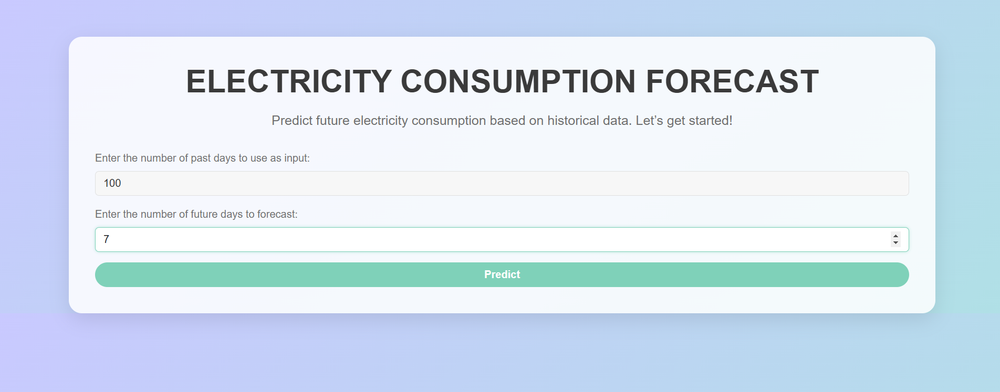
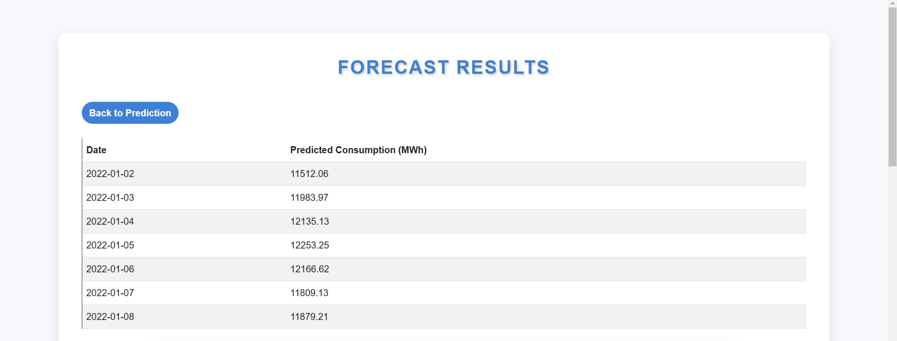
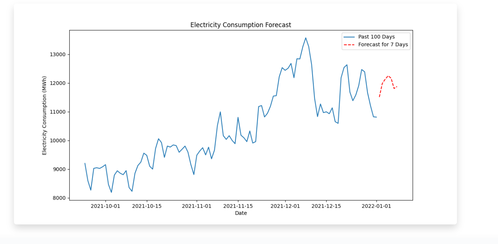

# **VoltVision: Energy Demand Forecasting**

This repository contains code for forecasting energy demand using a forecasting model for electricity consumption in Finland using LSTM (Long Short-Term Memory) neural network.

## **Introduction**
Energy demand forecasting is crucial for efficient energy management and planning. This project aims to predict future energy demand using historical data and machine learning techniques.

## **Project Overview**
This project involves the use of various machine learning models to forecast energy demand. The models are trained on historical energy consumption data to predict future demand accurately.

## **Workflow**
1. Data Collection: Gather historical energy consumption data.

2. Data Preprocessing: Clean and preprocess the data for model training.

3. Model Training: Train various machine learning models on the preprocessed data.

4. Model Evaluation: Evaluate the performance of the trained models.

5. Prediction: Use the best-performing model to forecast future energy demand.


## **Installation**

1. Clone the Repository.

2. Open Command Prompt and Docker.

3. Direct to the folder.

4. Build the Docker Image in Command Prompt.

```
docker build -t electricity-forecast-app .
```

5. Run docker Image using Command Prompt.

```
docker run -p 5000:5000 electricity-forecast-app
```

6. The app will run on  http://127.0.0.1:5000/


## **Screenshots**

Below are screenshots of the application:

### 1. Opening Page



This is the first page that appears when the application loads and user enters the previous days to consider and no of days to forecast.

### 2. Forecasting Results



Here, the forecast for next required no of days are displayed after getting from the trained LSTM Model.

### 3. Forecasting Graph



This graph shows the forecasting results after getting it from the trained LSTM Model as well as the previous data from the csv file.

### 4. Forecasting Statistics


This page displays the Statistics obtained from the above forecasts.


## **Conclusion:**

1. The code demonstrates a time series forecasting model for electricity consumption in Finland using LSTM (Long Short-Term Memory) neural network.


2. The model is trained on historical data from 2016 to 2021, and evaluated using train, validation, and test datasets.


3. The performance of the model is measured using Root Mean Squared Error (RMSE).


4. The results show that the LSTM model is able to predict the electricity consumption with a reasonable level of accuracy, both for training and testing datasets.


5. The model is also capable of forecasting future electricity consumption.


6. The visualizations help understand the electricity consumption patterns and the model's predictions over time.


7. Overall, the code provides a comprehensive framework for building and evaluating an LSTM model for time series forecasting.


## **Blog Publication**

To learn more about the project, methodology, and insights, read the full blog here:

🔗 **[Energy Demand Forecasting Blog](https://app.readytensor.ai/publications/HB2CfHmfbIfL)**


